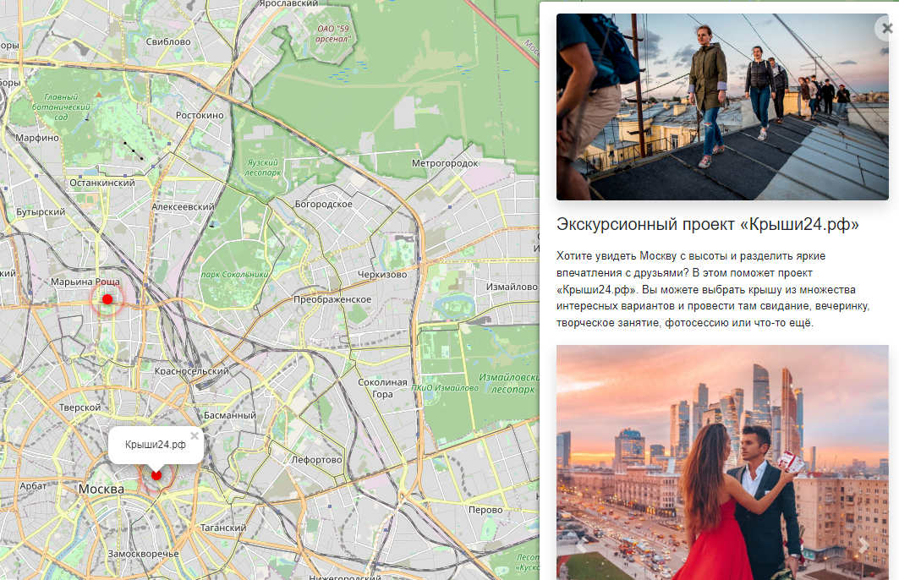

# (dvmn) Yandex.Afisha

Project created to share interesting Moscow places and give some information about it.
Starting server create map, where marked places from database with their description and photos.
Link for working site: [alexnv.pythonanywhere.com](https://alexnv.pythonanywhere.com/)

## Preview



## Install

 1. Clone repository:

```commandline
git clone https://github.com/alexnv/18-dvmn-yandex-afisha
```

 2. Install requirements:

```commandline
pip install -r requirements.txt
```

3. Create `.env` (example):

```commandline
SECRET_KEY=django-insecure-b5et!+...           # secret key of your Django-project
DEBUG=true                                     # true or false
ALLOWED_HOSTS=127.0.0.1, .pythonanywhere.com   # hosts. For local: 127.0.0.1

STATIC_URL=/static/                            # your static files url
STATIC_ROOT=assets                             # your static files dir name

MEDIA_URL=/media/                              # media files url.  Format: '/media_url/'
MEDIA_ROOT=media                               #media files dir name
```

 4. Make migrations:

```commandline
python3 manage.py migrate
```

 5. Create super user to django access:

```commandline
python3 manage.py createsuperuser

```

6. to run on pythonanywhere.com
```commandline
python3 manage.py collectstatic 
```

7. To start local site on `127.0.0.1:8000` domain:

```commandline
python3 manage.py runserver
```
## Help function

To loading places info from url with JSON-data, looking like:

```commandline
{
    "title": "Place_name",
    "imgs": [
        list of images urls
    ],
    "description_short": short descriptions (str)
    "description_long": long description (may contains html-tags)
    "coordinates": {
        "lng": "99.99999",
        "lat": "99.9999999"
    }
```

Running script:

```commandline
python manage.py load_place *url*
```
